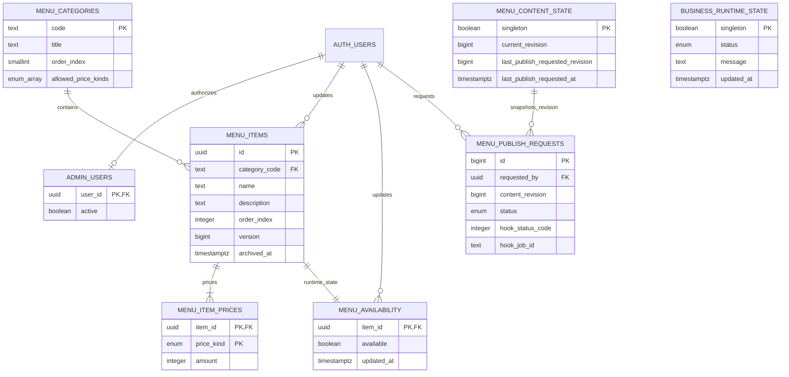

# Modelo de datos

`MENU_CATEGORIES`, `MENU_ITEMS` y `MENU_ITEM_PRICES` pertenecen a
`menu_content`; `MENU_AVAILABILITY` y `BUSINESS_RUNTIME_STATE` pertenecen a
`public`; los otros objetos de aplicación pertenecen a `app_private`.
